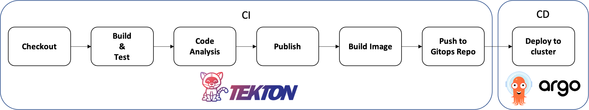
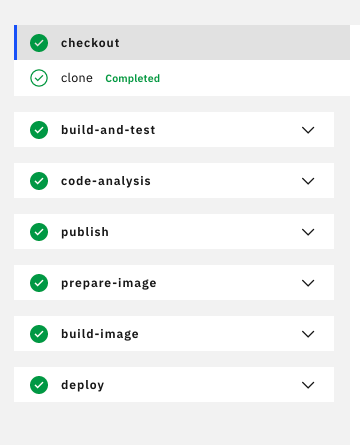
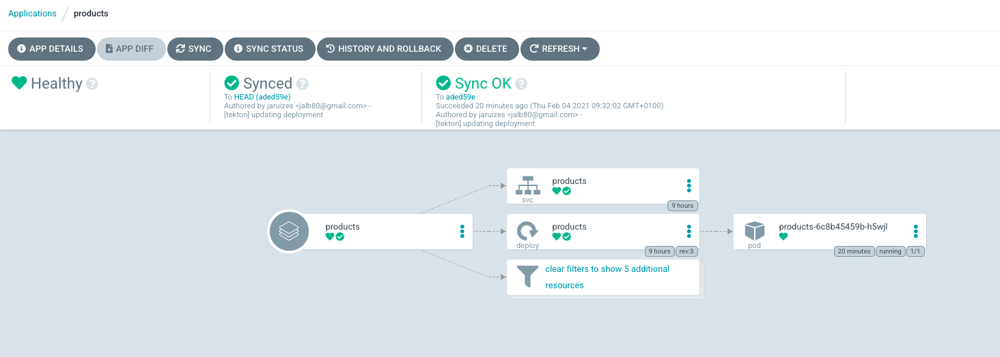

# Tekton-ArgoCD PoC


## Objetivo

El objetivo de la PoC es crear un pipeline que cubra todo el ciclo de CI/CD, desde la construcción al despliegue en el cluster de Kubernetes, utilizando herramientas Cloud Native como Tekton y ArgoCD. De esta forma se podrá testear de primera mano la madurez de ambas plataformas. 


## ¿Que es Tekton? 

**Tekton** es un framework Open Source para construir y ejecutar pipelines asociadas a CI/CD directamente en un cluster de Kubernetes. Basicamente, Tekton define una serie de objetos que extiende el API de Kubernetes y que se importan directamente en el cluster. Los principales objetos que define son:

- **Pipelines**: un pipeline es una colección de tareas. Un pipeline tiene una entrada y una salida definida
- **Task**: cada tarea está compuesta por una serie de pasos o **steps**. Al igual que el pipeline, las tareas tienen una entrada y una salida definida.

Las ejecuciones de los Pipelines y Tasks se pueden parametrizar, se representan por objetos **PipelineRun** y **TaskRun**

Mediante un pipeline de Tekton se puede cubrir el ciclo completo de CI/CD pero en esta PoC, el pipeline cubre únicamente la parte CI, delegando la parte CD a ArgoCD 

Se puede encontrar mucha más información sobre Tekton en la [página principal de la plataforma](https://tekton.dev/).


## ¿Qué es ArgoCD?

**ArgoCD** es una plataforma asociada a **GitOps** y por tanto, como su propio nombre indica, ligada a la parte de CD del proceso de CI/CD. Básicamente, ArgoCD (GitOps) se divide en aplicaciones que se asocian a un repositorio de ficheros asociados al despliegue y configuración de artefactos en un cluster. Cuando esos ficheros cambian (push), ArgoCD ejecuta las tareas necesarias para mantener actualizado el estado de esos artefactos en el cluster de Kubernetes. 

Al igual que Tekton se despliegua y ejecuta directamente en el cluster de Kubernetes.


## Estado del arte Tekton - ArgoCD

En el momento de construcción de esta PoC, nos encontramos con ambas plataformas en un estado muy "joven". Si por ejemplo tomamos como base el radar de ThoughtWorks (Volumenes 22 y 23 en el momento de la PoC), nos encontramos con el siguiente estado:

- **ArgoCD**: estado **Trial** (Volumen 22)
- **Tekton**: estado **Assess** (Volumen 23)

Otro punto a tener en cuenta es el historial de releases de ambas herramientas:

- **ArgoCD**: última versión liberada **1.8.3**
- **Tekton**: última versión liberada **0.20.1**

Esto nos confirma que estamos ante dos plataformas muy jóvenes, sobre todo Tekton, y que por tanto pueden pecar de poca madurez, documentación no muy completa o detallada, poco conocimiento y ejemplos en la comunidad y, lo más importante, pocas experiencias prácticas.

También hay que tener en cuenta que ambas herramientas pueden ser el estándar de facto dentro de las plataformas orientadas a CI/CD Cloud Native. De hecho, encontramos referencias y recomendaciones de uso por parte de la mayoría de los principales proveedores de PaaS / Cloud o CI/CD. 

Por ejemplo, si tomamos **Tekton**:

- **Google Cloud**: https://cloud.google.com/tekton?hl=es
- **Red Hat**, con Openshift Pipelines basadas ya en Tekton: (https://www.openshift.com/learn/topics/pipelines)
- **IBM**: https://www.ibm.com/cloud/blog/ibm-cloud-continuous-delivery-tekton-pipelines-tools-and-resources
- **Tanzu**: https://tanzu.vmware.com/developer/guides/ci-cd/tekton-what-is/
- **Jenkins X**: basando sus pipelines en Tekton  (https://jenkins-x.io/es/docs/concepts/jenkins-x-pipelines)

Si tomamos **ArgoCD**:

- **Red Hat**: https://developers.redhat.com/blog/2020/08/17/openshift-joins-the-argo-cd-community-kubecon-europe-2020/
- **IBM**: https://www.ibm.com/cloud/blog/simplify-and-automate-deployments-using-gitops-with-ibm-multicloud-manager-3-1-2


## CI/CD Cloud Native con Tekton y ArgoCD

¿Qué quiere decir esto? Quiere decir:

- **Escalabilidad**: La plataforma de CI/CD está desplegada en el propio cluster de K8s con lo que dispone de una capacidad de escalado natural, proporcionada por el propio cluster ya que cada tarea y pipeline se ejecutan como pods que se levantan y se terminan una vez que se ha completado la tarea

- **Portabilidad** de un cluster a otro, ya que las definiciones de los objetos base como de los pipelines y tareas se realiza mediante YAML y generan objetos que extienden el API de objetos de Kubernetes. Por tanto, es posible ejecutar los descriptores en cualquier cluster.

- **Reusabilidad**: existe un [hub/catálogo asociado directamente al proyecto Tekton](hub/catálogo asociado directamente al proyecto Tekton), en el que se pueden encontrar una serie de tareas para importar directamente en nuestros pipelines.

  También existe un [catálogo dentro de los proyectos asociados a Openshift](https://github.com/openshift/pipelines-catalog) en el que podemos encontrar las definiciones de las conocidas tareas "Source to image", implementando el concepto de buildpack.

  Se podría construir un catálogo propio de tareas y pipelines para poder distribuir en diferentes proyectos.


## PoC

Como se ha indicado anteriormente, la PoC construye un pipeline básico de CI/CD usando Tekton para la parte CI y ArgoCD para la parte CD.

El pipeline implementado es el siguiente:




### Organización del repositorio

La PoC consta de la siguiente estructura:

- proyecto **tekton-argocd-poc**: proyecto principal de la PoC
- grupo **Resources**: contiene los recursos asociados a la PoC
  - grupo **sources_repos**: contiene los grupos y proyectos relativos a código fuente de servicios/aplicaciones. Se divide en
    - grupo **services**: contiene el proyecto asociado al servicio de prueba que se usa en la PoC
      - proyecto **products**: servicio de prueba usado en la PoC
  - grupo **gitops_repos**: contiene los grupos y proyectos relativos a los ficheros de configuración y despliegue en el cluster de los servicios/aplicaciones contenidos en el grupo anterior (sources_repos). Se divide en:
    - grupo **services**: contiene el proyecto asociado al servicio de prueba que se usa en la PoC
      - proyecto **products-k8s**: servicio de prueba usado en la PoC


### Requerimientos

La PoC se ha realizado usando un cluster local basado en [K3D](https://k3d.io/). Por lo tanto es necesario tener instalado el cli de K3D y Docker. 

También, al trabajar contra un cluster de Kubernetes, es necesario tener instalado [Kubectl](https://kubernetes.io/docs/reference/kubectl/overview/).


#### Token de acceso a Gitlab

Es necesario indicar un token de acceso al repositorio de gitlab para que la PoC se pueda ejecutar, ya que descarga el código del servicio de ejemplo y hace push al repositorio de gitops para el despliegue en el cluster. Este token se debe incluir en los ficheros (del proyecto principal **tekton-argocd-poc**) siguientes:

- **argocd/git-repository.yaml**

  ```
  apiVersion: v1
  kind: Secret
  metadata:
    annotations:
      managed-by: argocd.argoproj.io
    name: repo-gitops
    namespace: argocd
  type: Opaque
  stringData:
    username: tekton
    password: ## INSERTAR TOKEN AQUI
  ```

  

- **tekton/git-access/secret.yaml**

  ```
  apiVersion: v1
  kind: Secret
  metadata:
    name: git-auth
    namespace: tekton-poc
    annotations:
      tekton.dev/git-0: https://github.com
  type: kubernetes.io/basic-auth
  stringData:
    username: tekton
    password: ## INSERTAR TOKEN AQUI
  ```

  


### Setup

Para facilitar la puesta en marcha de la PoC, dentro del proyecto principal **tekton-argocd-poc**, se han realizado dos scripts que levantan la PoC completa:

- **create_local_cluster.sh**: crea el cluster de K8s con K3D y también el registro local. Básicamente:

  - Crea un registry local para manejar las imágenes
  - Crea un cluster usando K3D llamado "tekton-poc-cluster" asociado al registry

- **setup_poc.sh**: instala y configura todos los elementos de la PoC en el cluster destino, es decir, contra el que esté configurado kubectl. Si se ha lanzado el script anterior, estará configurado directamente contra el cluster local. En otro caso, se podría lanzar contra un cluster en un proveedor de Cloud u on-premise. Realiza las siguientes acciones:

  - Despliega Tekton y ArgoCD en el cluster, creando también los secretos para poder acceder al repositorio Git

  - Crea el volumen y el claim necesario para la ejecución de los pipelines

  - Despliega el dashboard de Tekton

  - Despliega Sonarqube

  - Despliega Nexus

  - Crea el objeto ConfigMap que contiene el fichero settings.xml de Maven asociando la contraseña por defecto de Nexus al mismo para publicar los artefactos

  -  Instala las tareas de Tekton:

    - Git-clone (desde Tekton Hub)
    - Maven (desde Tekton Hub)
    - Buildah (desde Tekton Hub)
    - Prepare Image (tarea custom para la PoC)
    - Deploy con ArgoCD (tarea custom para la PoC)

  - Instala la aplicación de ArgoCD asociada a chequear los cambios en el repositorio de gitops del proyecto de prueba

    

También se proporciona un tercer script, **delete-local-cluster.sh**, para eliminar el cluster local una vez realizada la PoC.

** Estos scripts se han probado en OS X


### Dashboard

Para exponer el dashboard de Tekton se debe lanzar:

```
kubectl proxy --port=8080
```

El dashboard está accesible en la URL:

http://localhost:8080/api/v1/namespaces/tekton-pipelines/services/tekton-dashboard:http/proxy/#/namespaces/default/pipelines

En el dashboard se pueden consultar las ejecuciones de los pipelines y también lanzar ejecuciones nuevas




La acción de **deploy** realiza un push al repositorio de gitops y ArgoCD sincroniza el despliegue

El dashboard de ArgoCD se puede exponer mediante el comando:

```
kubectl port-forward svc/argocd-server -n argocd 9080:443
```

Y se accede al mismo en la url http://localhost:9080:



El usuario es admin y la contraseña se indica al finalizar el proceso de setup (script **setup_poc.sh** ) pero también se puede obtener con el comando:

```bash
kubectl get pods -n argocd -l app.kubernetes.io/name=argocd-server -o name | cut -d'/' -f 2
```


